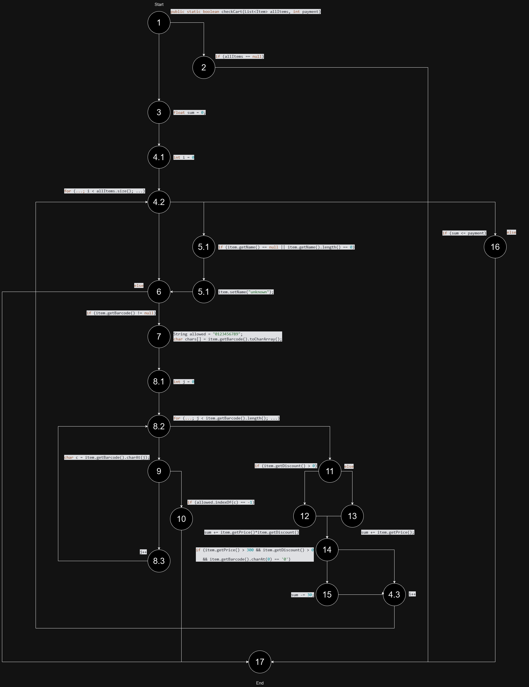
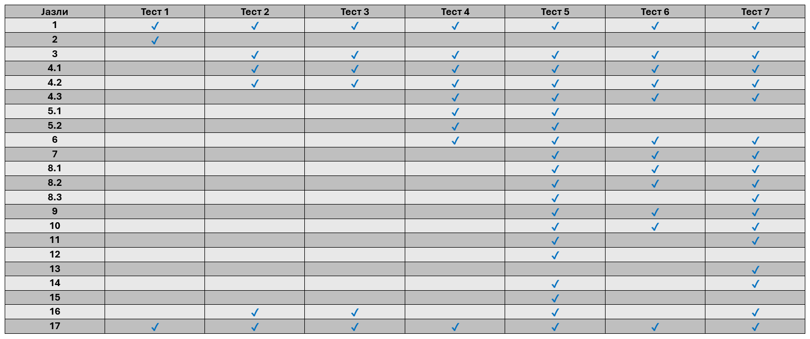

# Bojan Kotev 226143

# Control Flow Graph

# Цикломатска Kомплексност
Цикломатска комплексност се пресметува на следниот начин:
	**E - N + 2P** каде
		**Е** = број на ребра = 30
		**N** = број на темиња = 23
		**P** = број на компоненти = 1
		
Според формулата се добива цикломтска комплексност од **9**.

# Тест Случаи (Every Branch)

1. `allItems = null; payment = Any;`
	Се праќа празна вредност за allItems и било која вредност за payment. Функцијата фрла исклучок.
2. `allItems = []; payment = 0;`
	Се праќа празна листа за allItems и вредност 0 за payment. Функцијата се извршува успешно.
3. `allItems = []; paymnet = -1;`
	Се праќа празна листа за allItems и негативна вредност за payment. Функциајта се извршува успешно, но враќа False.
4. `allItems = [{name = "", barcode = null, price = "40", discount = "0.5"}]; payment = Any;`
	Се праќа еден објект со празен string за име и празна вредност за barcode, payment е било која вредност. Функциајта фрла исклучок.
5. `allItems = [{name = "", barcode = "012345", price = "3000", discount = "0.5"}]; payment = Any;`
	Се праќа еден објект со празен string за име, barcode кој содржи 0 и цена над 300, payment е било која вредност. Функцијата се извршува успешно.
6. `allItems = [{name = "Name", barcode = "ABC123", price = "127", discount = "0.5"}]; payment = Any;`
	Се праќа еден објект со име и barcode кој содржи букви, payment е било која вредност. Функциајта фрла исклучок.
7. `allItems = [{name = "Name", barcode = "098765", price = "30", discount = "-1"}], payment = Any;`
	Се праќа еден објект со име, barcode кој содржи 0, цена помала од 300 и негативна вредност за discount, payment е било која вредност. Функциајта се извршува успешно.

# Тест Случаи (Multiple Condition)
Услов: `if (item.getPrice() > 300 && item.getDiscount() > 0 && item.getBarcode().charAt(0) == '0')`
1. За `price = 350, discount = 0.5, barcode = "012345"` следува `if (true && true && true)`. Услувот е задоволен.
2. За `price = 250, discount = 0.5, barcode = "012345"` следува `if (false && true && ture)`. Условот не е задоволен.
3. За `price = 400, discount = 0, barcode = "012345"` следува `if (true && false && true)`. Условот не е задоволен.
4. За `price = 400, discount = 1, barcode = "123456"` следува `if (true && true && false`. Условот не е задоволен.

# 